# ATC Pro real world weather fix
The "download real world weather" option broke when [aviationweather.gov](https://aviationweather.gov) switched from HTTP to HTTPS

To fix this issue patching of `wxSimulator.dll` was required to point to the new URLs being used and and disabling SSL certificate validation

I've included a patched DLL as well as the steps to patch the DLL manually since downloading DLLs from the internet is usually frowned upon.


## Patched DLL download
[Virus total check](https://www.virustotal.com/gui/file/3e5dd13917ce781013d7beba6929e426ac5a9d8ccd1128f9e184ef7905c3fef0)

[Download wxSimulator.dll](./wxSimulator.dll)

To install:
- Make a backup of `wxSimulator.dll` (usually found in `C:\Program Files (x86)\Flag Mountain\ATCpro`)
- Download the DLL provided above
- Copy the downloaded DLL into your game folder (usually `C:\Program Files (x86)\Flag Mountain\ATCpro`)

## Manual DLL patch

### Environment setup and finding the DLL
- [Download dnSpy 32 bit](https://github.com/dnSpy/dnSpy/releases/download/v6.1.8/dnSpy-net-win32.zip)

- Run dnSpy, Select `File > Open...`, navigate to the ATPro install folder (usually `C:\Program Files (x86)\Flag Mountain\ATCpro`) and open `ATCPro.exe`
- At the top of the dnSpy window click `Start`. This will open a new window, make sure the `Executable` field points to `ATCPro.exe` and click `OK`. ATCPro should now launch

    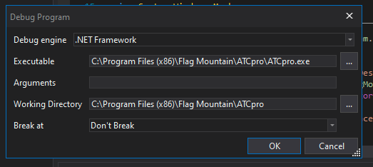


- At the top of the dnSpy window click the `Pause` icon.

    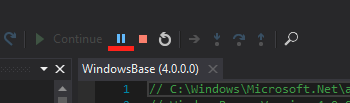


- At the bottom of the dnSpy window click on `Modules`. Right click anywhere in the Modules Pane and select `Open All Modules`

    


### Fixing the download URLs

- On the left side pane called `Assembly Explorer`, expand the module `wxSimulator`, expand `wxSimulator.dll`, expand `SimWeather`

    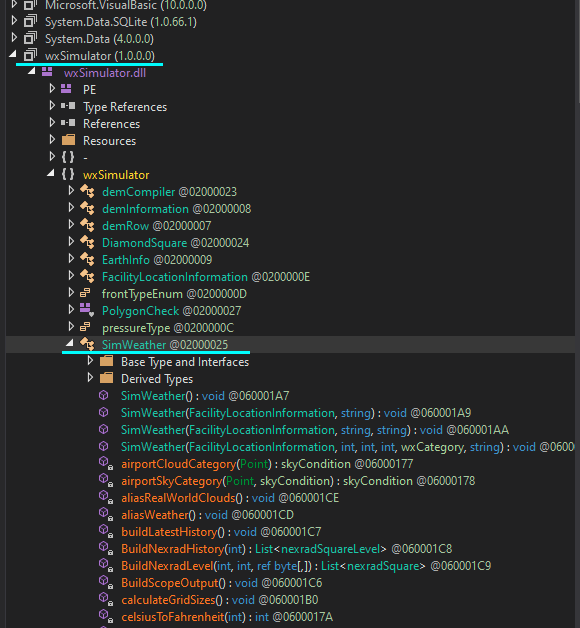


- In the Assembly Explorer right click on `SimWeather()` and select `Edit Method Body...`. 

    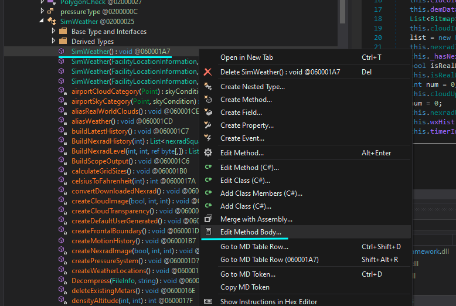


- A new window will open. Line 12 will contain the URL ATCPro tries to fetch the METAR information from. Change the URL from `http://aviationweather.gov/adds/dataserver_current/current/metars.cache.xml.gz` to `https://aviationweather.gov/adds/dataserver_current/current/metars.cache.xml.gz`
After changing the URL press `OK`

    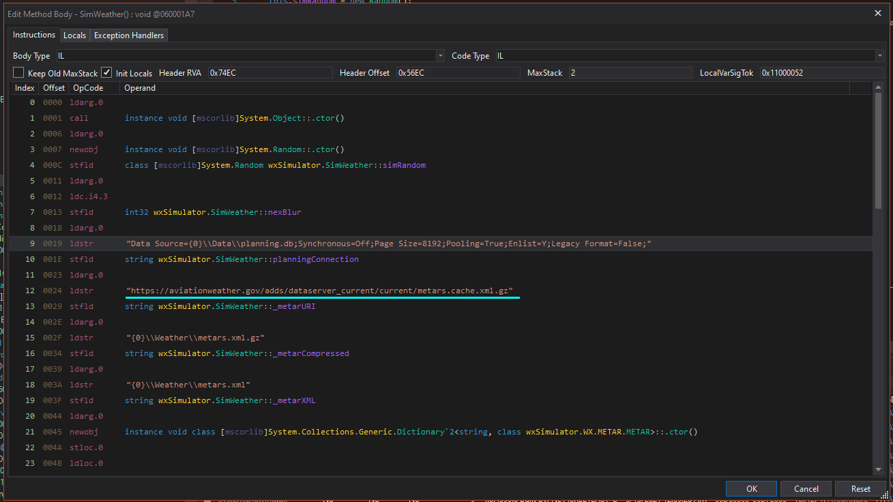


- In the Assembly Explorer right click on `SimWeather(FacilityLocationInformation, string)` and select `Edit Method Body...`

    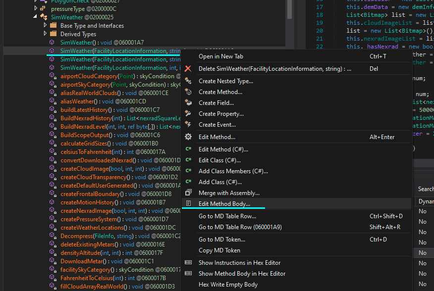


- A new window will open. Line 12 will contain the URL ATCPro tries to fetch METAR information from. Change the URL from `http://aviationweather.gov/adds/dataserver_current/current/metars.cache.xml.gz` to `https://aviationweather.gov/adds/dataserver_current/current/metars.cache.xml.gz`
After changing the URL press `OK`

    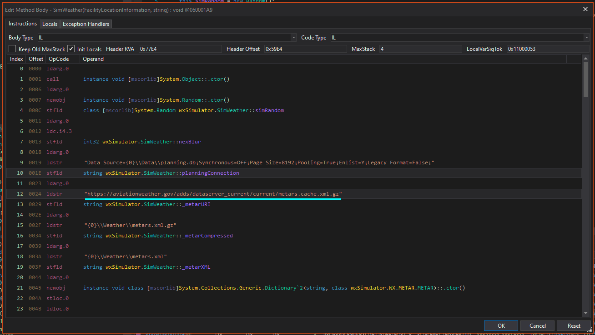


- In the Assembly Explorer right click on `SimWeather(FacilityInformation, string, string)` and select `Edit Method Body...`

    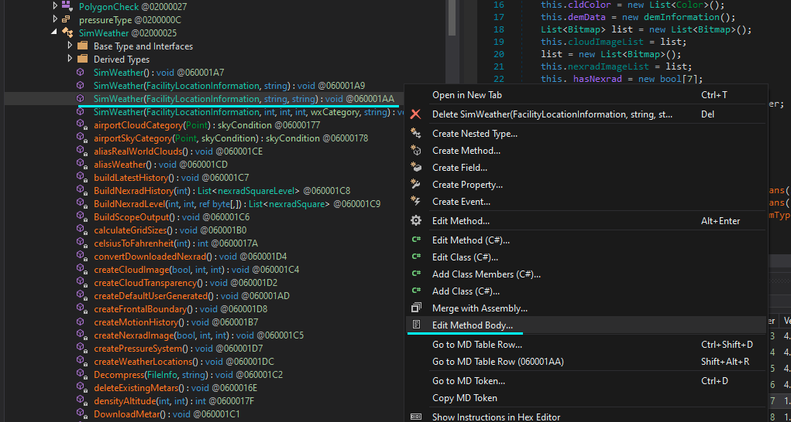


- A new window will open. Line 12 will contain the URL ATCPro tries to fetch METAR information from. Change the URL from `http://aviationweather.gov/adds/dataserver_current/current/metars.cache.xml.gz` to `https://aviationweather.gov/adds/dataserver_current/current/metars.cache.xml.gz`
After changing the URL press `OK`

    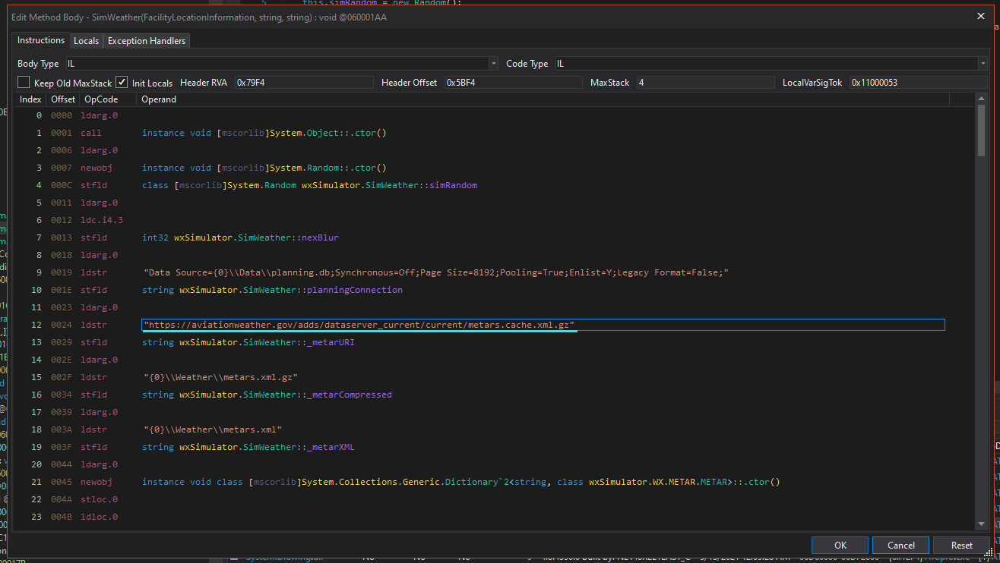


- In the Assembly Explorer right click on `SimWeather(FacilityInformation, int, int, int, wxCategory, string)` and select `Edit Method Body...`

    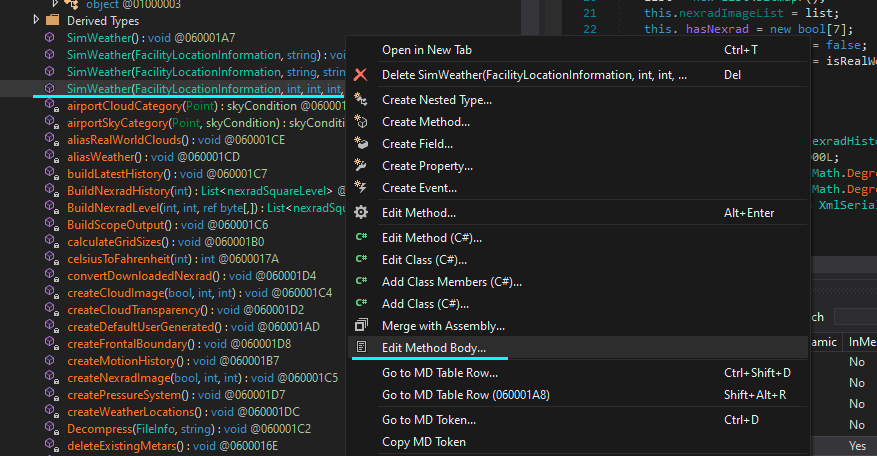


- A new window will open. Line 12 will contain the URL ATCPro tries to fetch METAR information from. Change the URL from `http://aviationweather.gov/adds/dataserver_current/current/metars.cache.xml.gz` to `https://aviationweather.gov/adds/dataserver_current/current/metars.cache.xml.gz`
After changing the URL press `OK`

    


### Final step, fixing SSL errors

- In the Assembly Explorer pane, right click on `DownloadMetar()` and select `Edit Method (C#)...` 

    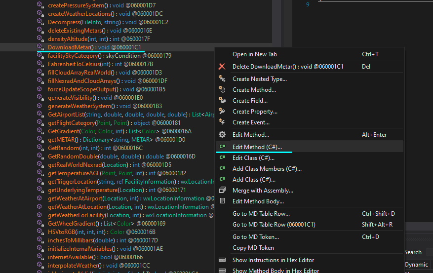


- A new window will open showing the source code. Add the following 2 lines to the code to match the picture below
    ```C#
    System.Net.ServicePointManager.Expect100Continue = true;
    System.Net.ServicePointManager.SecurityProtocol = System.net.SecurityProtocol.Tls12;
    ```
    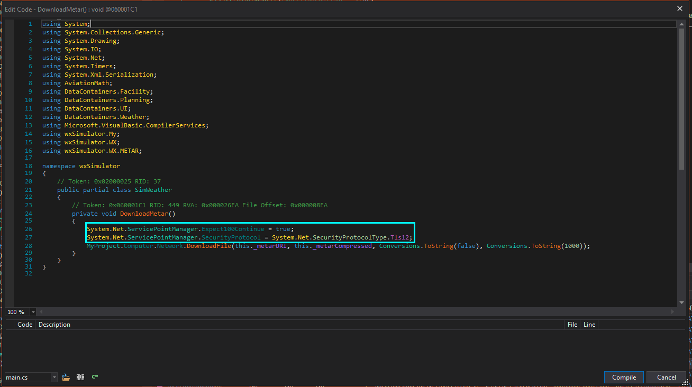


- Once your changes has been made, click `Compile`
- If all went well the Compilation should be successfull and the window automatically closed.
- At the top left corner of dnSpy click on `File > Save Module...`, make sure to change `filename` by clicking on the three dots `...`  and navigating to your `Desktop` folder

     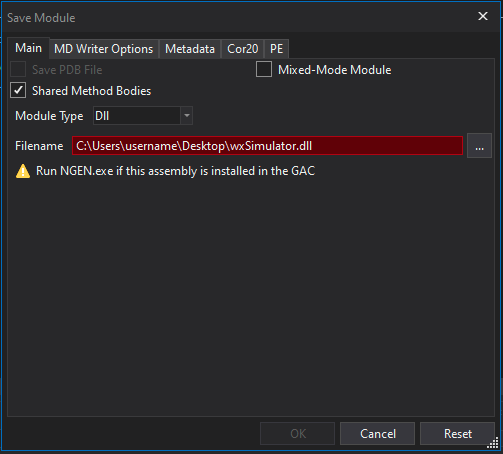


- Click `OK`
- You can now close dnSpy


### Finishing up
- Go to your ATCPro install directory (usually `C:\Program Files (x86)\Flag Mountain\ATCpro`) and make a backup of `wxSimulator.dll`
- Copy `wxSimulator.dll` from your desktop to the install directory and replace if neccesary
- "download real world weather" should now be working
